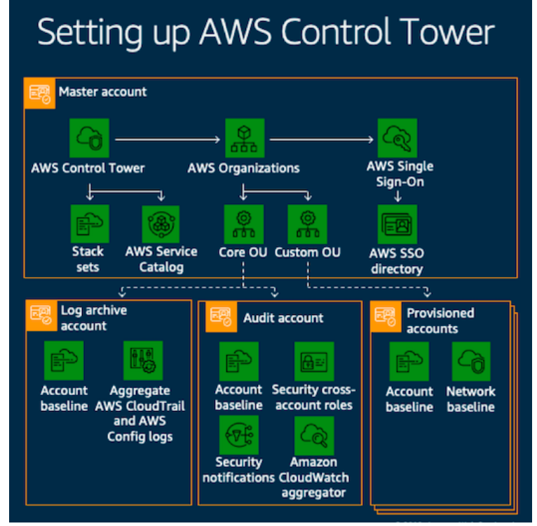

# Landing Zone



### Basic assumptions for Landing Zone

1. Multi-account **- Security controls - Isolation \(account as a unit of security protection\)** **- Data Isolation** **- Many Teams** **- Business Process** **- Billing** **- Limit allocation**
2. Uses AWS Control Tower or Custom Built

### Key components of Landing Zone:

* Log Archive account
* Audit Account
* Privisioned accounts
* Master Account

### AWS root user vs. Master account

There are two different types of users in AWS. You are either the account owner \(root user\) or you are an AWS Identity and Access Management \(IAM\) user. The root user is created when the AWS account is created and IAM users are created by the root user or an IAM administrator for the account. All AWS users have security credentials.

* Root user - account owner \(physical entity\)
* Master account - IAM user

